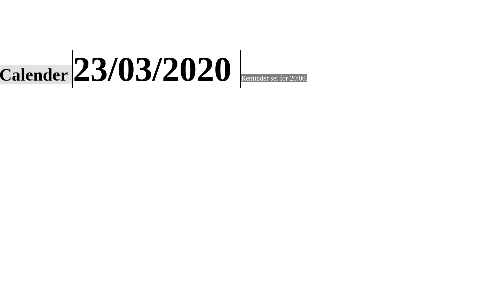
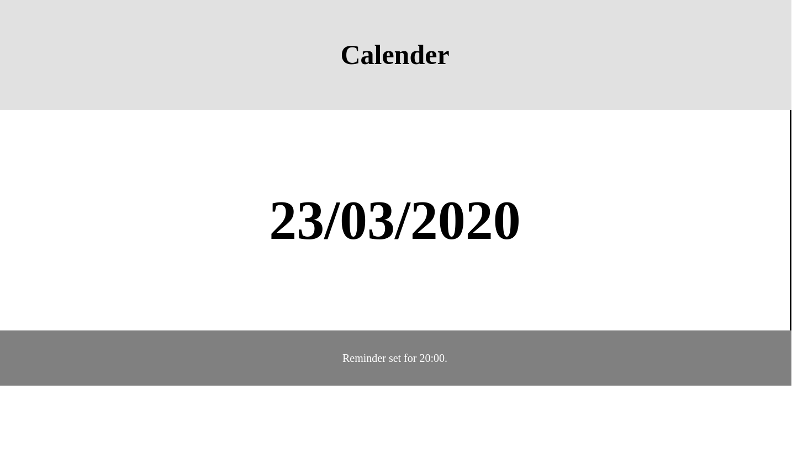

# Display properties

**Before we start**

Before we start with these exercises, I want you to take a good look in the documentation, and search for the term `display`.
Take a good read to see what the difference are and what it exactly does.

Please take your time with this! It is important to know the basics about this.

**Instructions**

Copy this code in your editor:

```html
<!DOCTYPE html>
<html lang="en">
<head>
  <meta charset="UTF-8">
  <meta name="viewport" content="width=device-width, initial-scale=1.0">
  <meta http-equiv="X-UA-Compatible" content="ie=edge">
  <title>Display properties - exercise 1</title>
  <style>

    body{
  margin:0;  
        }

    .title{
      height:200px;
      text-align:center;
      background-color:#dddd;
      font-size:50px;
      line-height:200px;
    }
    
    .date{
      height:400px;
      border-left: 3px solid black;
      border-right: 3px solid black;
      font-size:100px;
      line-height:400px;
      text-align:center;
    }
    
    .reminder{
      height:100px;
      background:grey;
      color:white;
      font-size:20px;
      line-height:100px;
      text-align:center;
}
  </style>
</head>
<body>
  <strong class="title">
    Calender
  </strong>
  <b class="date">
    23/03/2020
  </b>
  <small class="reminder">
    Reminder set for 20:00.  
  </small>

</body>
</html>
```

You should see something like this:



Find a way to display it like this:



**NOTE:** Do not change the HTML tags or content.

Only work with your styling. Keep in mind what we just learned about.