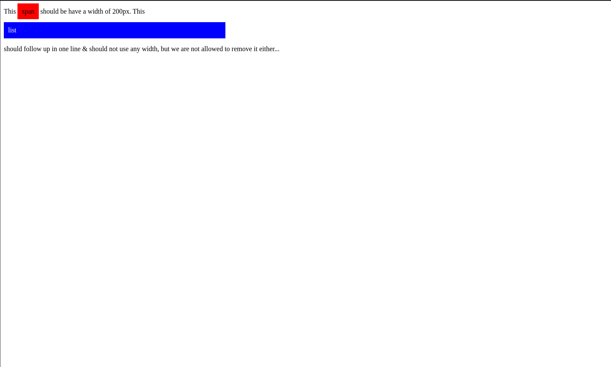
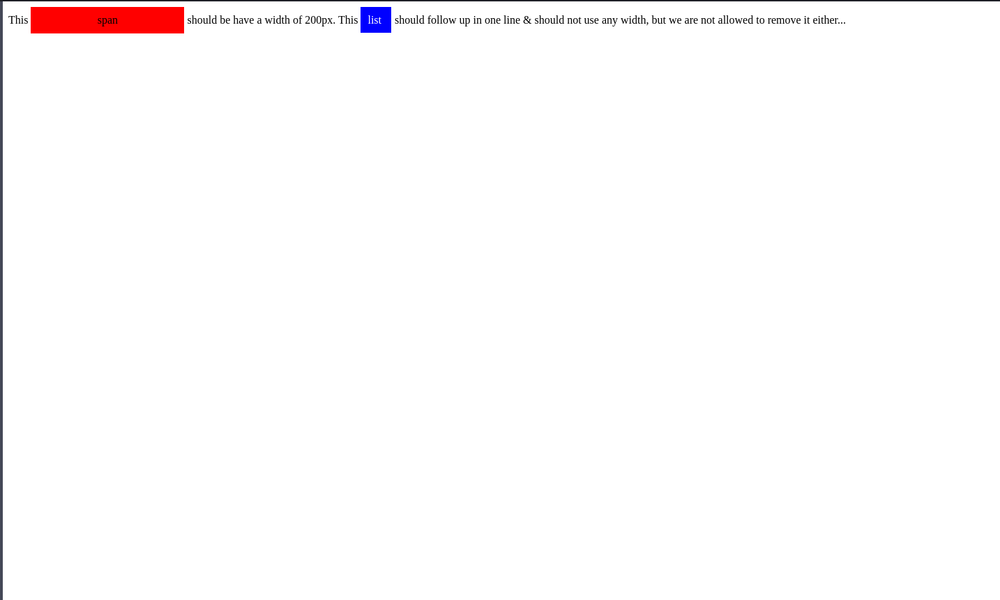

# Display properties - sentence

**Instructions**

Code in editor:

```html
<!DOCTYPE html>
<html lang="en">
<head>
  <meta charset="UTF-8">
  <meta name="viewport" content="width=device-width, initial-scale=1.0">
  <meta http-equiv="X-UA-Compatible" content="ie=edge">
  <title>Display properties - Exercise 2</title>
  <style>
    span{
      background-color:red;
      padding:10px;
      text-align:center;
    }
    
    li{
      color:white;
      background:blue;
      padding:10px;
      margin-right:5px;
      width:500px;
    }
    
    ul{
      margin:0;
      padding:0;
    }
  </style>
</head>
<body>
  <p> This <span>span</span> should be have a width of 200px. This</p>
  <ul>
    <li>
      list
    </li>
  </ul> 
<p> should follow up in one line & should not use any width, but we are not allowed to remove it either...
</p>
</body>
</html>   
```

You should see something like this:

s

Find a way to display it like this:



**NOTE:** Do not change the HTML tags or content.

Only work with your styling. Keep in mind what we just learned about.
||
<!DOCTYPE html>
<html lang="en">
<head>
  <meta charset="UTF-8">
  <meta name="viewport" content="width=device-width, initial-scale=1.0">
  <meta http-equiv="X-UA-Compatible" content="ie=edge">
  <title>Display properties - Exercise 2</title>
</head>
<body>
  <p> This <span>span</span> should be have a width of 200px. This</p>
  <ul>
    <li>
      list
    </li>
  </ul> 
<p> should follow up in one line & should not use any width, but we are not allowed to remove it either...
</p>
</body>
</html>  
||
span{
    background-color:red;
    padding:10px;
    text-align:center;
}
li{
    color:white;
    background:blue;
    padding:10px;
    margin-right:5px;
    width:500px;
}
ul{
    margin:0;
    padding:0;
}