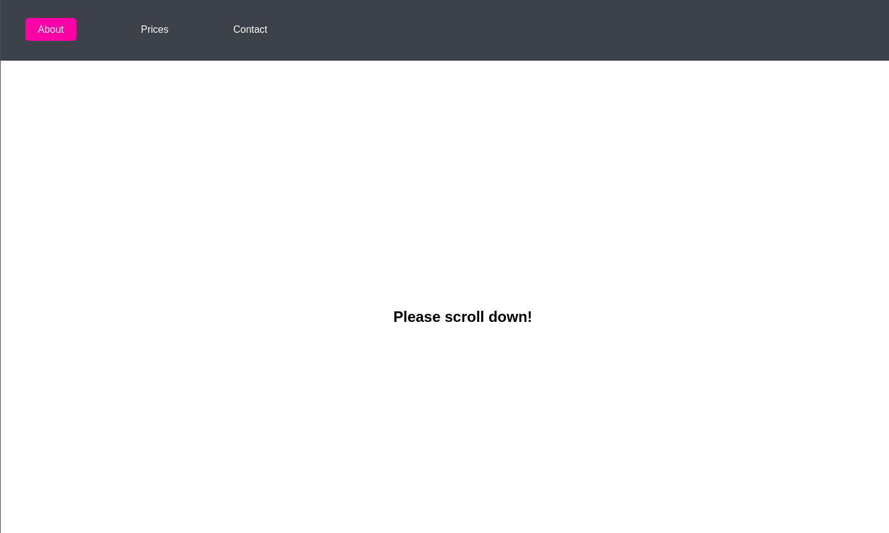

# Position navbar

### Before we start

Before we start with these exercises, I want you to take a good look in the documentation, and search for the term `position`.
Take a good read to see what the difference are and what it exactly does.

Please take your time with this! It is important to know the basics about this.

### Set up

Copy the following code in your editor:

```html
<html>
<head>
    <meta charset="UTF-8">
    <meta name="viewport" content="width=device-width, initial-scale=1.0">
    <meta http-equiv="X-UA-Compatible" content="ie=edge">
    <title>Position - Exercise 2</title>
    <style>
        body{
            height:3600px;
            padding:0;
            margin:0;
            font-family:sans-serif;
             }
        h2{
            margin:0;
            padding-top:500px;
            text-align:center;
             }
    /* Put your styling here */
    </style>
</head>
<body>
    <nav>
    <!--Please make your own navbar here!-->
    </nav>
    <section>
        <h2>Please scroll down!</h2>
    </section>
    <section>
        <h2>The navbar should still be visible down here!</h2>
    </section>
</body>
</html>
```

### On the job

As a refreshment of everything we have currently seen so far. I want you to re-create this simpel navbar.



After this, find a way to let the navbar stick to the top of the screen.