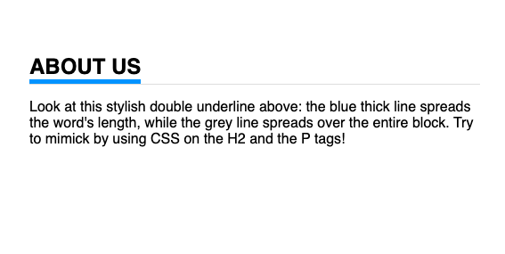

# Exercise: borders

**Instruction**

Look at this stylish double underline below : the blue thick line spreads the word's length, while the grey line spreads over the entire block. Try to mimick by using CSS on the H2 and the P tags!

**Tip 1:** You will need to use the display property on the `h2`element. Check the documentation to find out which value you will need. (Standard value is `block` which is why the line covers the whole page.)

**Tip 2:** Find a way to set the font family to 'sans-serif'.

**Tip 3:** Color: #2A99FB.



**Content in the editor**

```html
<body>
    <h2>About Us</h2>
    <p>Look at this stylish double underline above: the blue thick line spreads the word's length, while the grey line
  spreads over the entire block. Try to mimick by using CSS on the H2 and the P tags!</p>
</body>
```