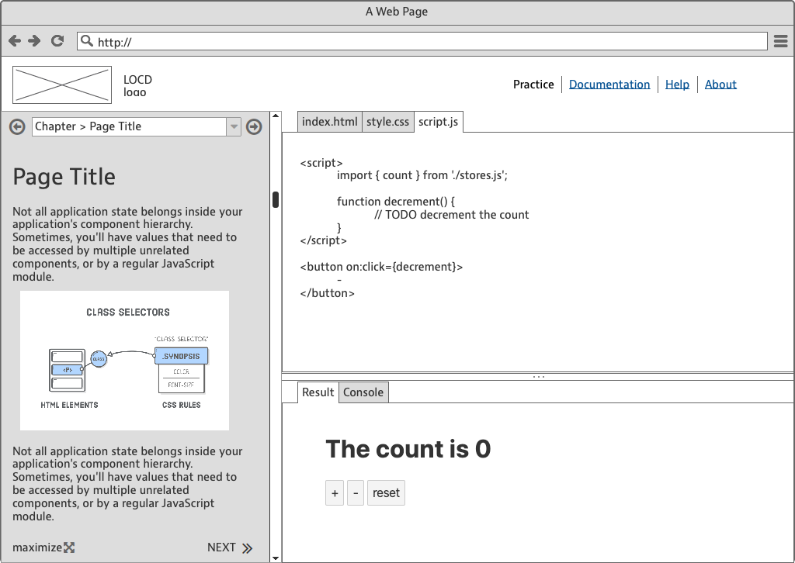

# Project: LOCD: Learn Offline Coding  by Doing

LOCD (pronounce `Hello SeeDee!`) is a tool to generate an offline RPL (Read-Eval-Print-Loop) application to learn frontend coding by ... coding !

The tool aims at allowing people with no coding background to learn html, css and javascript, in a mostly "learning by doing" methodology. The final objective is to help them taste coding and decide if frontend development is something they would like to pursue as a professional career.

## Strictly offline

 The tool is targeting training contexts where there is poor or no access to the internet and particularly: remote areas, refugee camps and prisons. 

The client machine should be a simple computer with a fairly recent browser.

The delivery mode must be either :

- a  USB Key containing the Browser Setup package and the LCDO web application (package as a folder containing only static html, css and javascript files, along with static assets like audio, video, images and fonts).

- a html5 package, as a zip, available to be used on kolibri Studio

## Example

- Svelte online Tutorial: [https://svelte.dev/tutorial/](https://svelte.dev/tutorial/) : it contains the entire learning material and presents it next to a "practice" zone. Having both theory and exercise in the same screen is very cognitively efficient and it encourages the learner to try directly. Unfortunately, the tool requires a local server to run. [See the Code]([https://github.com/sveltejs/svelte/tree/master/site](https://github.com/sveltejs/svelte/tree/master/site)).

## 2 Target audiences

### Learner UX

Learner wants to learn coding by doing in order to one day become a frontend integrator. The screen is 90% similar to Svelte Tutorial . There is a "theory/instructions" zone on the left, and the right is divided with above: the code editor, and below, the code renderer, including a console.

What is different than Svelte: there is a maximize button allowing to give the entire space to the Theory/Instructions zone. [See Mockup](./study & ux/ux/LOCD-LUX.pdf)

### Trainer UX

**Trainer wants to write content (theory and exercises) efficiently and rapidly.**

Trainer has at least junior-level coding knowledge and can follow instructions to "build" the application.

The Trainer's UX will mostly be 

- to create a folder structure and add content to it using MarkDown. 

- to preview its work, (s)he should run a command that parses the content and re-generates LOCD html+css+javascript code into a standalone folder - ready for the testing.

- to deliver its work, trainer must "build" the package as a zip file, ready for Kolibri Studio.

## Technical solution

Gatsby ? Sapper ?
